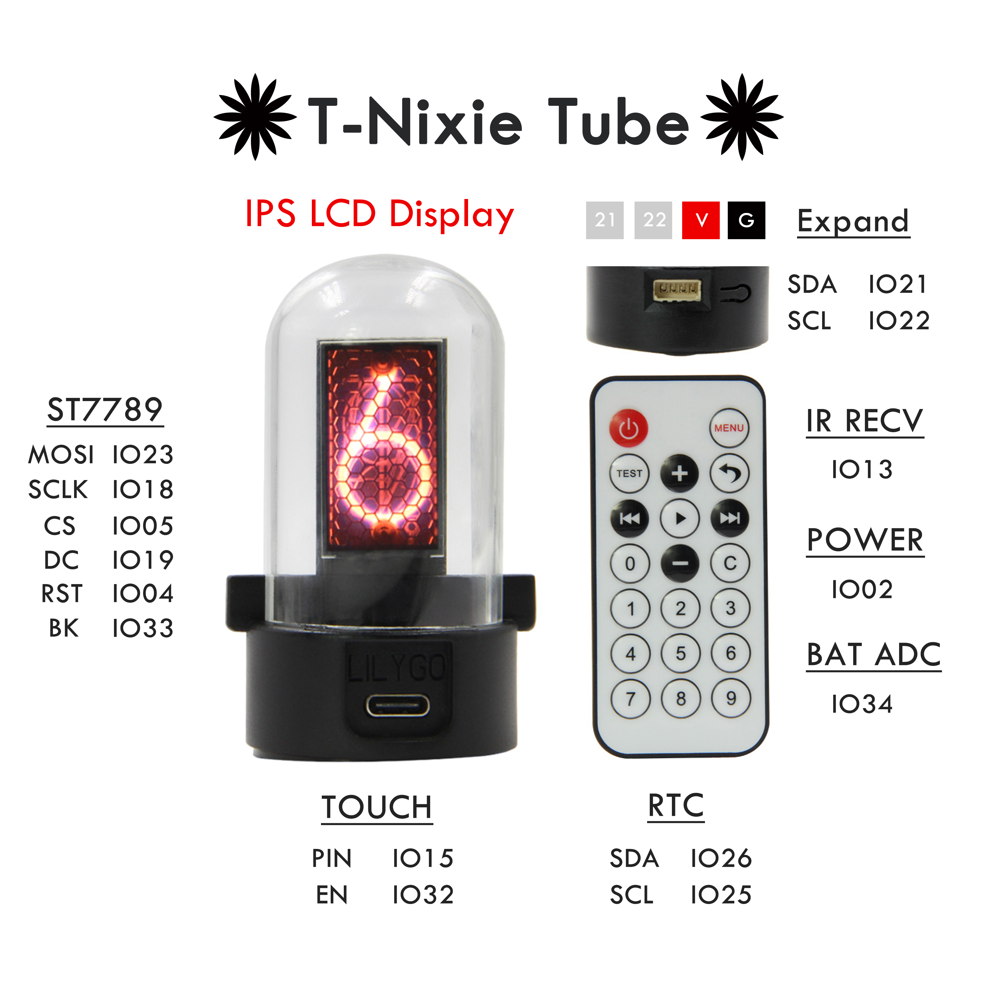
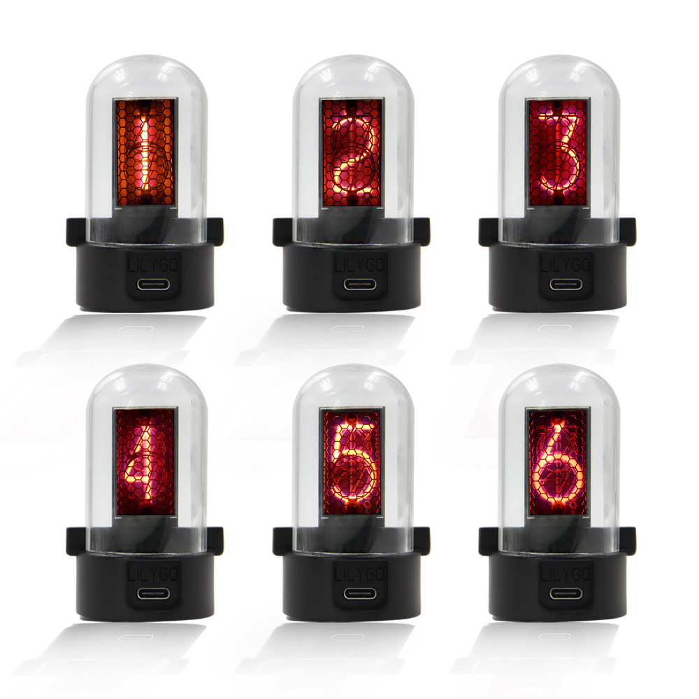
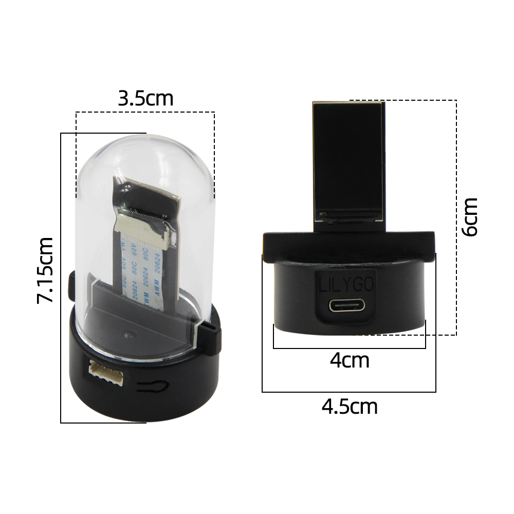
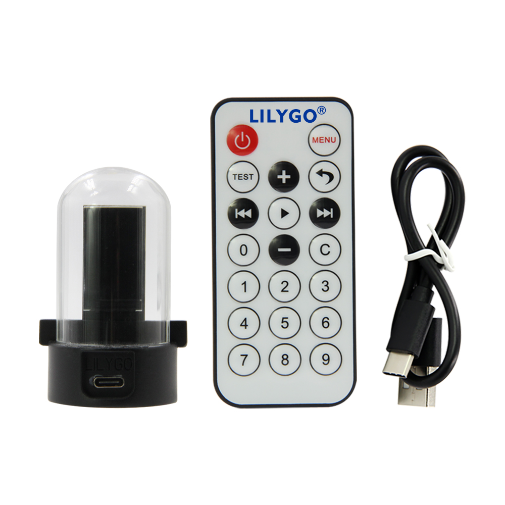

<h1 align = "center">🌟LilyGO OLED🌟</h1>
  
## Quick start
1. Copy  **lib/TFT_eSPI-master**  to the  **<C:\Users\Your User Name\Documents\Arduino\libraries>**  directory
2. Open the **T-NixieTube.ino** 
3. In the **Arduino IDE** tool options, select the development board  **ESP32 Dev Module**, **select Disable in the PSRAM option**, **select 4MB in the Flash Size option**, Other keep the default
4. Select the corresponding serial port. If you are not sure, please remove all the serial ports, leaving the board in the USB connection state, just select that one
5. Finally, click upload, the right arrow next to the tick

-------------------------

1. 拷贝  **lib/TFT_eSPI-master**  到  **<C:\Users\你的用户名\Documents\Arduino\libraries>**  目录内
2. 打开运行  **T-NixieTube.ino** 
3. 在**Arduino IDE** 工具选项中 ， 开发板选择 **ESP32 Dev Module**,**在PSRAM选项中选择Disable**， **Flash Size 选项中选择4MB** ，其它保持默认 
4. 选择对应的串行端口，如果不清楚请移除所有串行端口，之保留板子处于USB连接状态，选择那一个即可
5. 最后可点击上传即可，勾号旁边的向右箭头

-------------------------  
## Pinout

## Show

